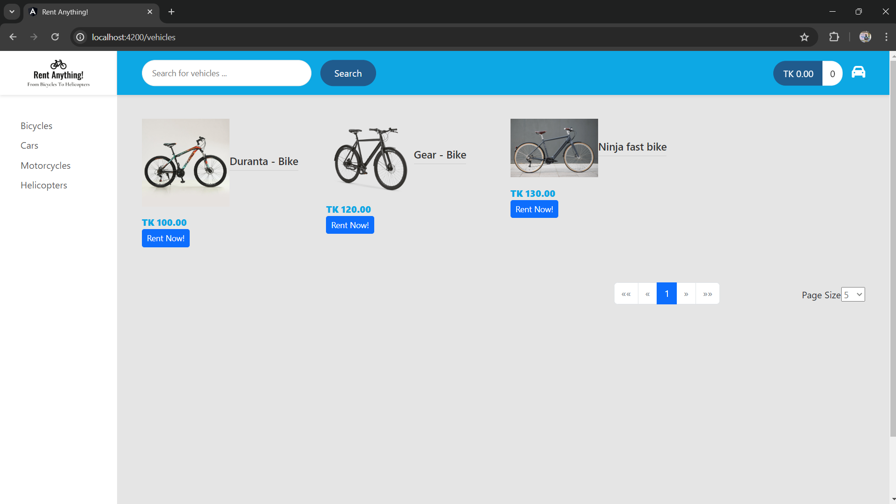
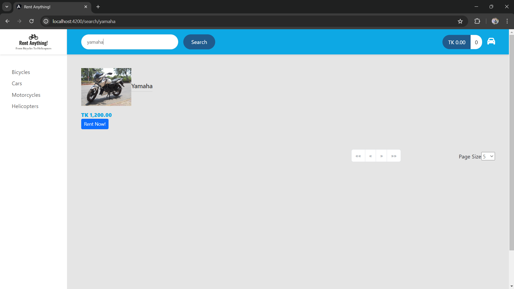
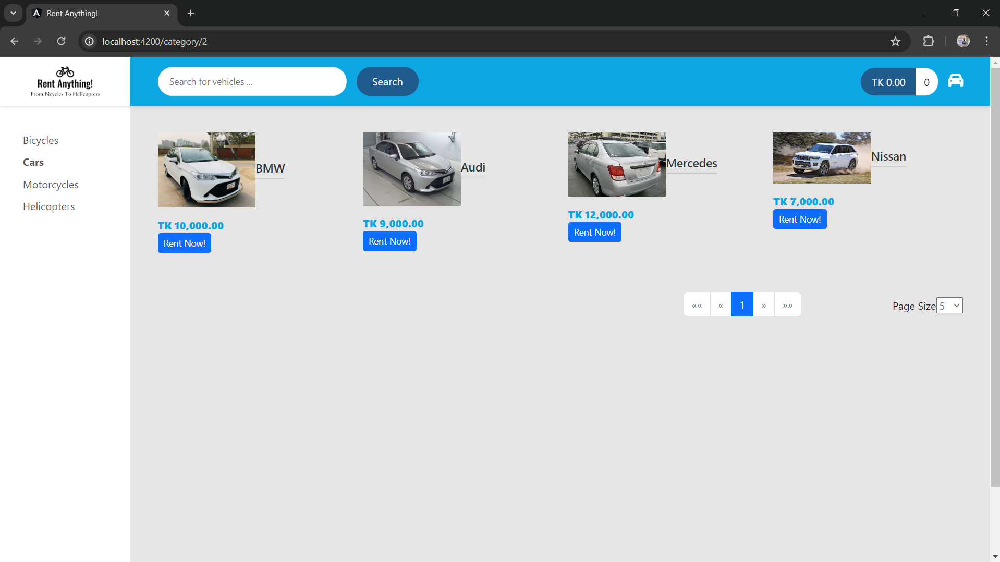
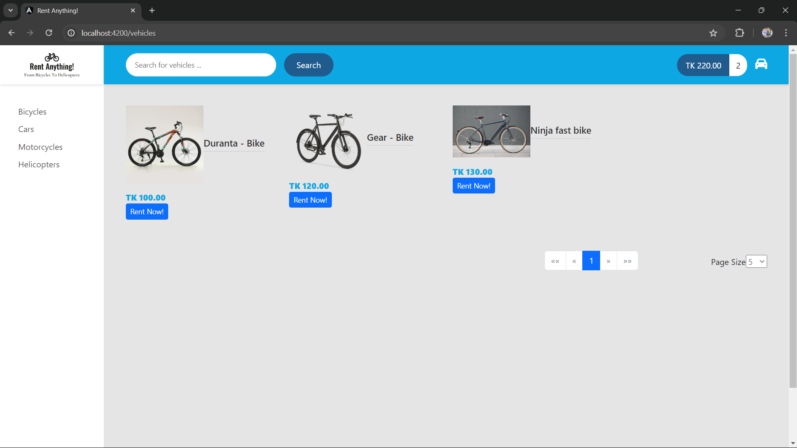
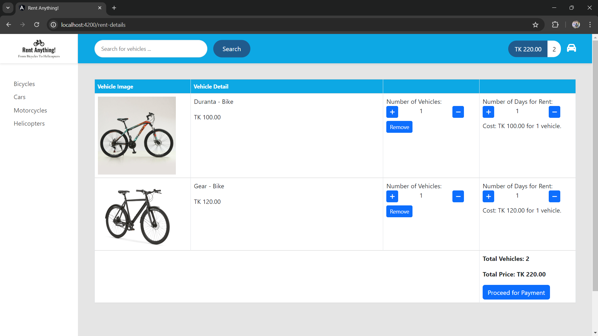
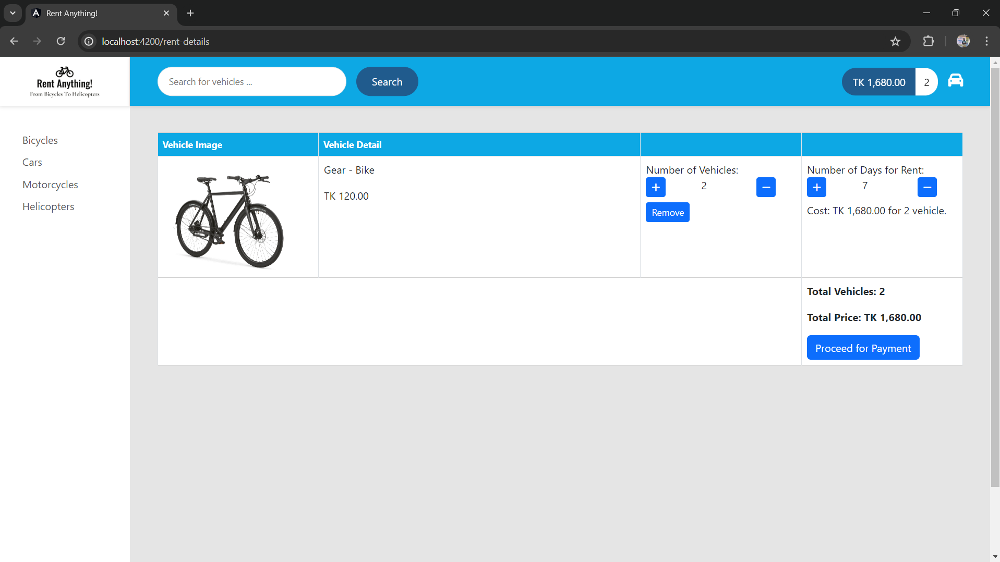
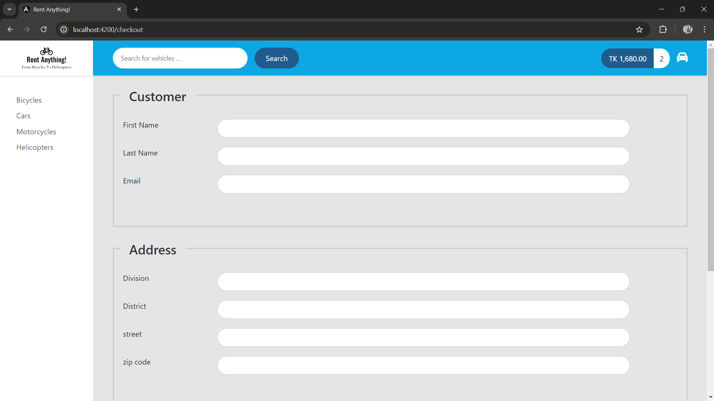
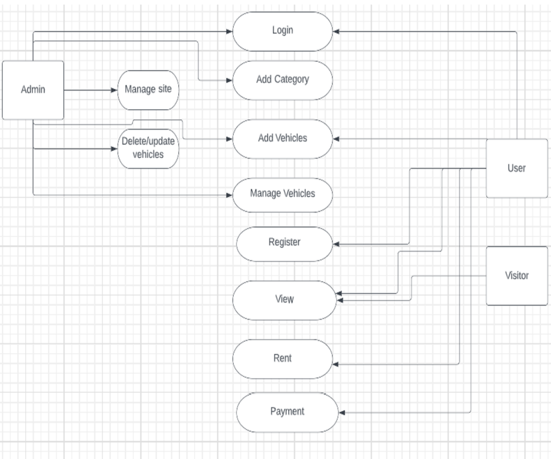
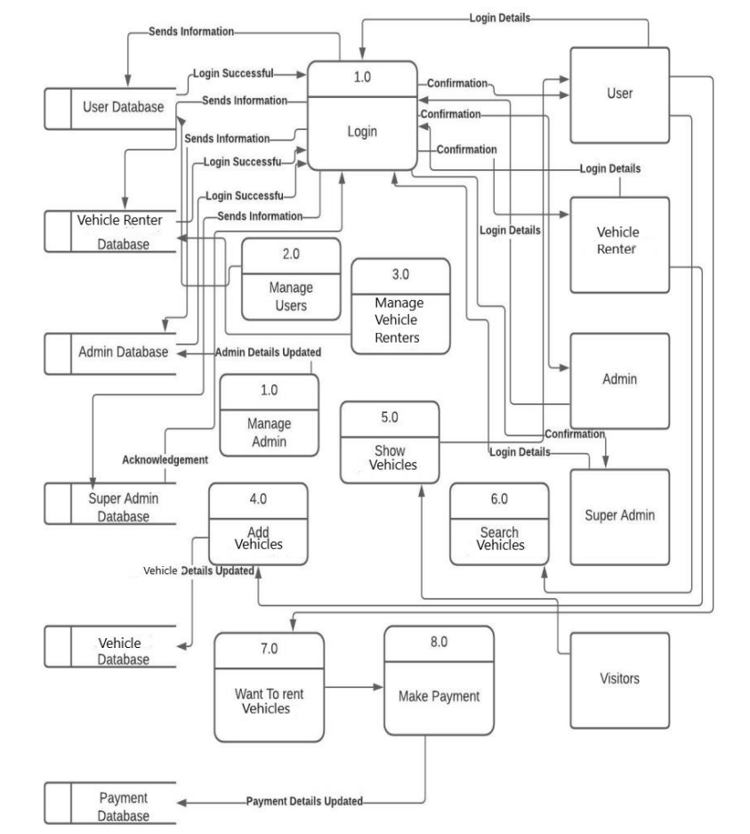
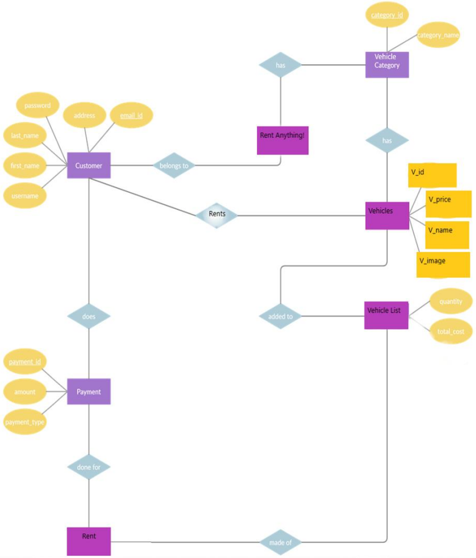

# RentAnything-spring-angular

Full Stack webApp "RentAnything!" where you can rent almost anything from bicycles to helicopters. Used Spring Boot on the backend and Angular on the frontend and Mysql database.

## Homepage

## You can search a vehicle by it's name

## Or you can browse vehicles from Vehicle Category

## Click **Rent Now!** and rent a vehicle. Here, we clicked on the first two Bicycles totaling 220 tk.

## Click on the vehicle icon for Rent Details

## Select total Number of Days for Rent and proceed

# Fill up the Rent Address and other info

## Use Case Diagram

## Data Flow Diagram

# Entity Relationship Diagram

